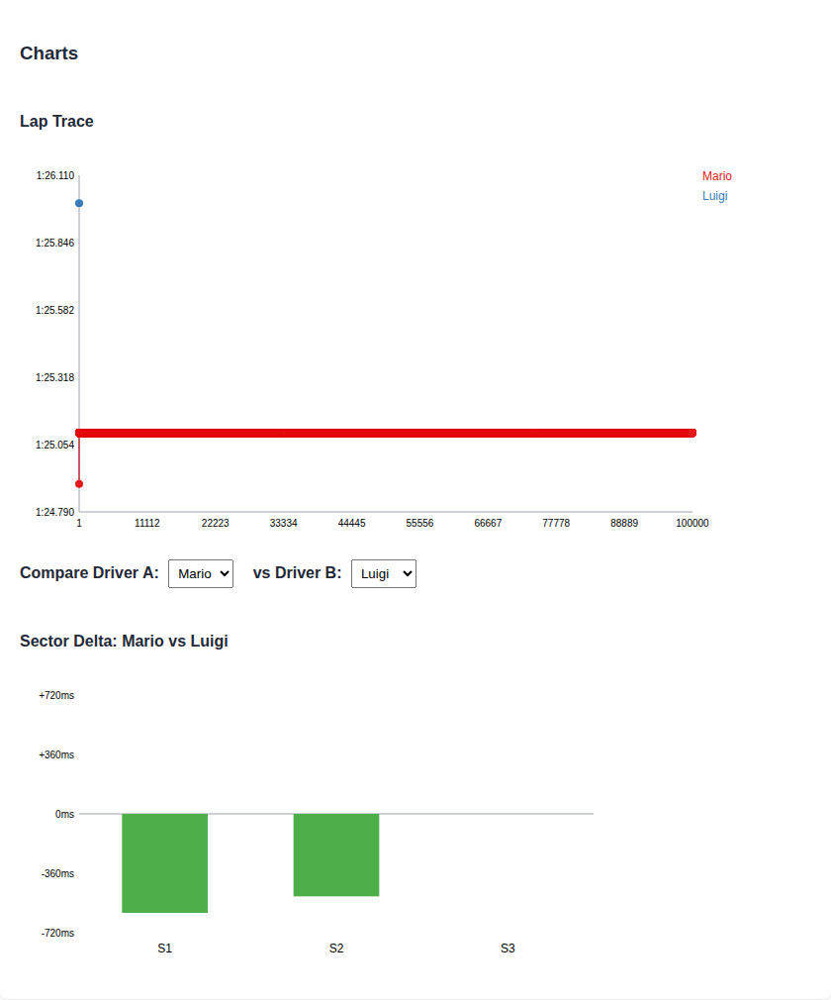
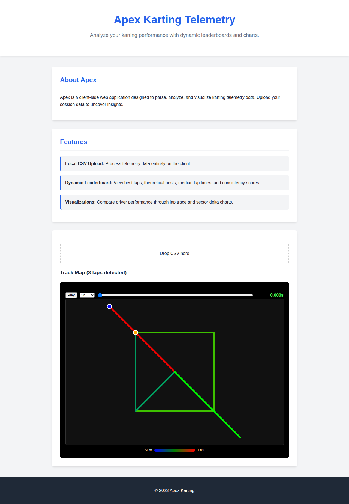

# Apex

## Screenshots




## About Apex
Apex is a client-side karting telemetry and leaderboard app. It supports parsing telemetry data, local CSV upload handling, robust data validation, displaying dynamic leaderboard and charts, track map rendering, GPX/GPS CSV parsing, speed gradients, and ghost sync replay.

## Features
- **Local CSV Upload:** Process telemetry data entirely on the client.
- **Dynamic Leaderboard:** View best laps, theoretical bests, median lap times, and consistency scores.
- **Visualizations:** Compare driver performance through lap trace and sector delta charts.
- **Track Map Rendering:** Visualize track maps derived from telemetry data.
- **GPX and GPS CSV Parsing:** Import raw GPS telemetry files.
- **Speed Gradients:** View speed differences visually on the track map.
- **Ghost Sync Replay:** Replay and compare laps simultaneously.

## How to Run
Since there is no build step, you can run the app by serving the `src` directory using any local web server and opening `index.html` in your browser.

Example using `serve`:
```bash
npx serve src
```

Example using Python's `http.server`:
```bash
python3 -m http.server -d src
```

## Testing
To run tests, install dependencies and use Playwright:
```bash
npm install
npx playwright install
npm run test
```
