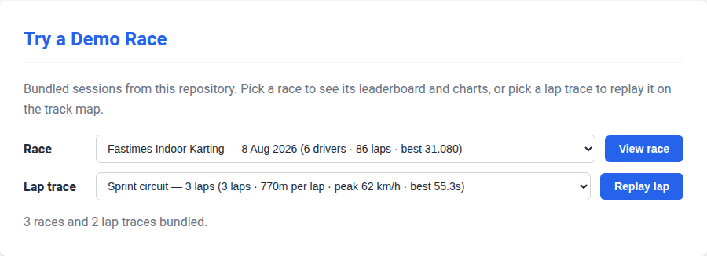
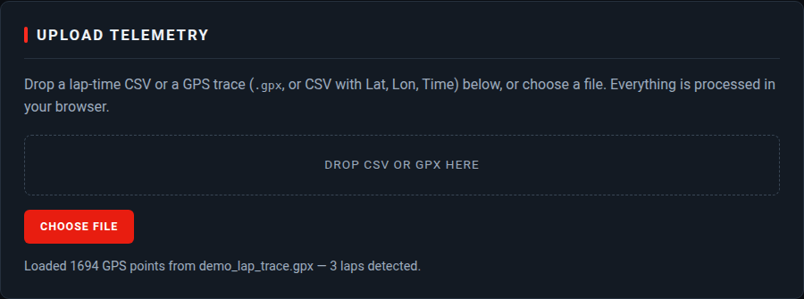
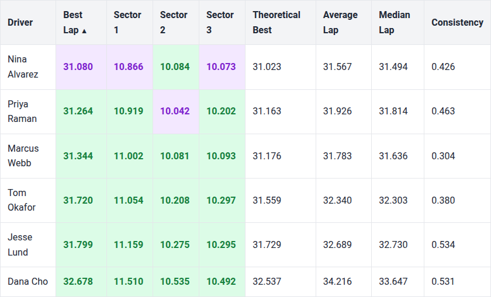
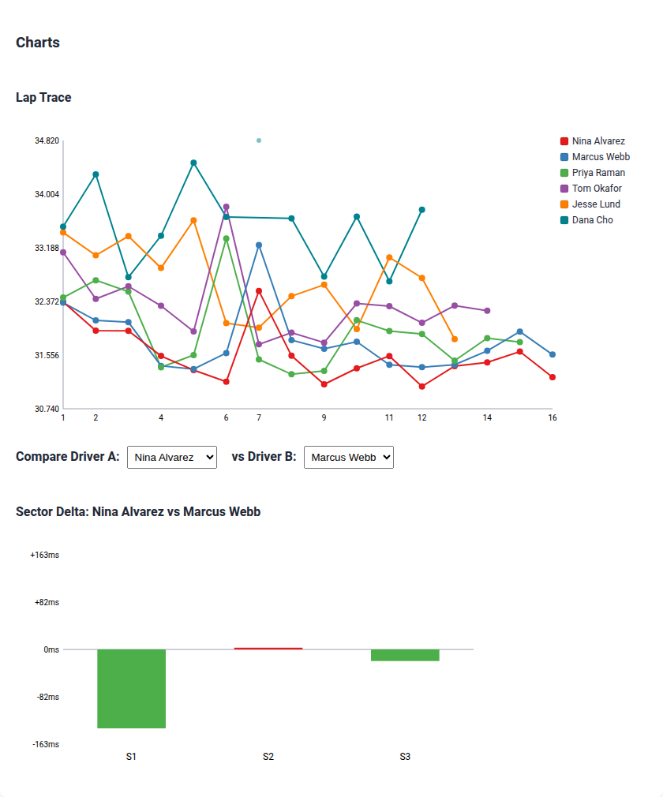
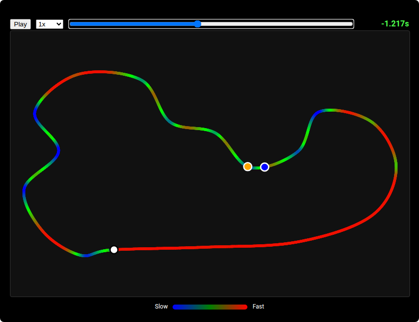

# Apex

Apex is a client-side karting telemetry and leaderboard app. Drop a session
export into the browser and it parses the data, ranks the drivers, charts their
laps, and draws the track from GPS telemetry — with no server, no build step,
and no data leaving the machine.

**[Open the live app](https://neilweitzel.github.io/Apex-Race-Telemetry/)** — then
upload one of the demo files from `dataset/` to populate it.

## Features

- **Local CSV Upload:** Process telemetry data entirely on the client.
- **Dynamic Leaderboard:** View best laps, theoretical bests, median lap times, and consistency scores.
- **Visualizations:** Compare driver performance through lap trace and sector delta charts.
- **Track Map Rendering:** Visualize track maps derived from telemetry data.
- **GPX and GPS CSV Parsing:** Import raw GPS telemetry files.
- **Speed Gradients:** View speed differences visually on the track map.
- **Ghost Sync Replay:** Replay and compare laps simultaneously.

## How to Run

There is no build step. Serve the `src` directory with any local web server and
open `index.html`:

```bash
npm start                    # npx serve src -p 3000
npx serve src                # equivalent
python3 -m http.server -d src
```

No upload is needed to try it: the **Try a Demo Race** panel at the top offers
every session bundled in `dataset/`.

## Supported Files

Apex decides how to read a file from its header row, not its name, so a lap CSV
recorded at a track called "Atlanta" is never mistaken for a GPS trace.

**Lap CSV** — drives the leaderboard and charts. Needs `Driver`, `Lap` and
`Time`; `Track`, `Date` and `Sector 1..3` are optional. Times accept `M:SS.mmm`
or plain seconds, and columns may appear in any order.

```csv
Track,Date,Driver,Lap,Time,Sector 1,Sector 2,Sector 3
Fastimes Indoor Karting,2026-08-08,Nina Alvarez,1,32.367,11.354,10.485,10.528
Fastimes Indoor Karting,2026-08-08,Nina Alvarez,2,31.929,11.261,10.255,10.413
Fastimes Indoor Karting,2026-08-08,Marcus Webb,1,32.712,11.402,10.573,10.737
```

**GPS trace** — drives the track map, speed gradient and ghost replay. Either a
`.gpx` file, or a CSV with `Lat`, `Lon` and `Time` columns (`Time` may be a
timestamp or a millisecond offset).

```csv
Lat,Lon,Time
39.6422259,-86.0671299,0
39.6422263,-86.0670154,100
39.6422268,-86.0669008,200
```

```xml
<trkpt lat="39.6422259" lon="-86.0671299">
  <time>2026-08-08T14:12:30Z</time>
</trkpt>
```

Uploading a second file for the same track and date adds to that session rather
than replacing it, so one file per driver works. Rows that cannot be read are
skipped and listed instead of failing the whole upload.

## Walkthrough

### 1. Pick a demo race

The demo panel lists the bundled races and lap traces, each labelled with what is
inside it — drivers, laps, best lap, circuit length, peak speed. **View race**
loads a session into the leaderboard and charts; **Replay lap** loads a GPS trace
onto the track map and starts the ghost replay. Loading several races keeps each
one on the page as its own session.



Demo files are read with the same parsing and rendering path as an upload, so
what you see in the demo is exactly what your own file will do.

### 2. Upload your own

Drag a file onto the dropzone, or use the file picker. The status line reports
what was loaded, and unreadable rows are listed beneath it.



### 3. Leaderboard

Every driver's best lap, best sector times, theoretical best (the sum of their
own best sectors), average, median, and consistency — the standard deviation of
their representative laps, so a low number means a driver who repeats the same
lap. Purple marks the session best for a column; green marks a driver's own
best. Any column header sorts, by mouse or keyboard.



### 4. Charts

The lap trace plots every lap in the order it was set, which exposes warm-up
laps, traffic, and the rookie's spin on lap 7 (clamped to the top of the chart
as an outlier). The sector delta chart compares any two drivers: green means
driver A gained in that sector, red means they lost.



### 5. Track map and ghost replay

The racing line is coloured by speed, from blue through green to red, clipped to
the 5th–95th percentile so a single GPS glitch cannot wash out the scale. The
white marker is the start/finish line. With two or more laps detected, the
replay controls scrub two karts around the lap synchronized by distance: the
readout is how much time the ghost lap has lost or gained at that exact point on
track.



## Demo Data

`dataset/` is the single source of truth for demo telemetry. All of it is
synthetic — no real driver or GPS data is included.

| File | Contents | Offered as |
| --- | --- | --- |
| `demo_session.csv` | 86 laps, 6 drivers, 3 sectors, a traffic lap each and one spin | Race — Fastimes Indoor Karting, 8 Aug 2026 |
| `demo_race_whiteland_sprint.csv` | 90 laps, 5 drivers, outdoor circuit, ~46.4s best | Race — Whiteland Raceway Park, 25 Jul 2026 |
| `demo_race_endurance_night.csv` | 148 laps, 6 drivers, long runs on worn tyres | Race — Fastimes Indoor Karting, 11 Aug 2026 |
| `demo_lap_trace.gpx` | 1,694 points at 10 Hz, 771 m circuit, 3 laps, 29–64 km/h | Lap trace — sprint circuit (GPX) |
| `demo_technical_trace.csv` | 1,820 points at 10 Hz, 512 m circuit, 4 laps, slower and tighter | Lap trace — technical layout (GPS CSV) |
| `scale_10k_laps.csv` | 10,001 deliberately repetitive laps | Not offered; parse and render performance only |

Because GitHub Pages serves only `src/`, the demo files are published into
`src/demo/` alongside `src/demo/manifest.json`, which the picker fetches to build
its dropdowns. Both are generated — never edit them by hand:

```bash
npm run generate:data   # regenerate dataset/ (deterministic) and sync src/demo/
npm run sync:demo       # only refresh src/demo/ from dataset/
```

Manifest labels are derived by running each file through the app's own parsers,
so a dropdown can never claim something the data does not contain. `npm run
validate:data` fails if `src/demo/` drifts from `dataset/`, and a test asserts
the same.

## Validating Data

`npm run validate:data` checks every file in `dataset/` and `fixtures/` through
the same parsers the app uses. It reports parse errors and also data-quality
problems that make a file misleading — sector times that do not add up to the
lap time, duplicate driver and lap keys, drivers with a single lap, implausible
lap times, or a trace whose speed never varies.

```
[OK] dataset/demo_session.csv  (valid)
       1 session(s), 86 laps
       Fastimes Indoor Karting 2026-08-08: 6 driver(s), best 31.080

[OK] dataset/demo_lap_trace.gpx  (valid)
       1694 points, 143.6s, 3 lap(s), peak 64.4 km/h
```

`scripts/data-expectations.json` records each file's intent, so a fixture that is
broken on purpose is reported as expected rather than as a repo problem. The
command exits non-zero on any unexpected finding and runs in CI.

## Testing

```bash
npm install
npx playwright install
npm test
```

The suite covers the pure logic in `src/lib/` as unit tests and the UI as
end-to-end tests, including visual baselines. Refresh the README screenshots
after a UI change with:

```bash
npm run screenshots
```

## Deployment

Pushing to `main` publishes `src/` to GitHub Pages through
`.github/workflows/deploy.yml`, which serves the live app linked above. The
workflow validates the telemetry data and runs the full test suite before
publishing, so a failing build never reaches the site, and it can be run from the
Actions tab to redeploy the current `main` without a new commit.

## Project Structure

```
src/lib/     pure logic: CSV/GPX parsing, format detection, stats, geometry, replay maths, IndexedDB
src/ui/      DOM rendering: upload wiring, leaderboard, charts, track map, replay controls
tests/       Playwright unit and end-to-end specs, plus visual baselines
src/demo/    generated copies of the demo data plus manifest.json, served to the picker
fixtures/    small files used by tests, including deliberately malformed input
dataset/     demo and performance data (source of truth)
scripts/     data generation, sync and validation tools
docs/        README screenshots
```
