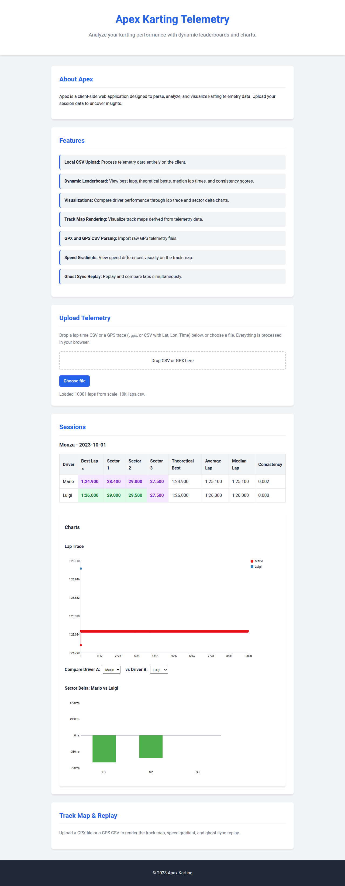

# Apex

## Screenshots



## About Apex
Apex is a client-side karting telemetry and leaderboard app. It supports parsing telemetry data, local CSV upload handling, robust data validation, and displaying dynamic leaderboard and charts.

## How to Run
Since there is no build step, you can run the app by serving the `src` directory using any local web server and opening `index.html` in your browser.

Example using `serve`:
```bash
npx serve src
```

Example using Python's `http.server`:
```bash
python3 -m http.server -d src
```

## Testing
To run tests, install dependencies and use Playwright:
```bash
npm install
npx playwright install
npm run test
```
